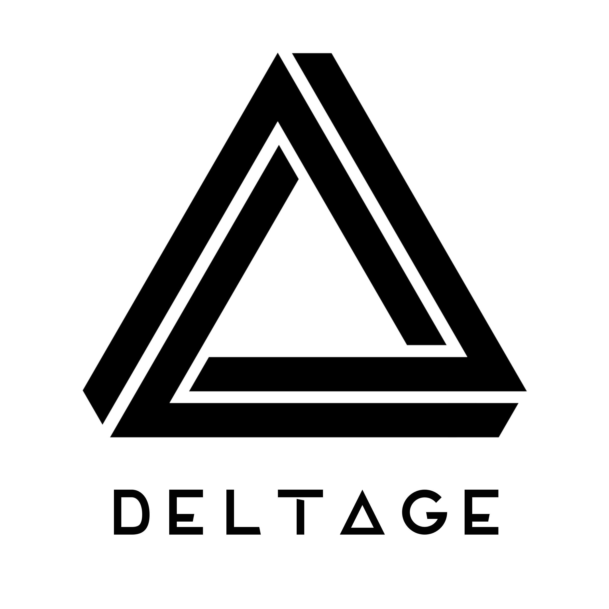

# 

*A cryptocurrency tool to help find and act on arbitrage opportunities*.

This work is an [EDA](https://devacademy.co.nz/ "Enspiral Dev Academy") final project by Adam, Maddie, Peter, Tim and Tyler in the Harakeke-2018 cohort.

Arbitrage is the simultaneous buying and selling of assets (securities, currency, cryptocurrency, commodities) in different markets. The trader can then take advantage of differing prices for a particular asset.

The *Delt&Delta;ge* name was chosen for this project because:

- delta is used by many disciplines to represent a difference or change
- the name is a contraction of delta and arbitrage
- deltage is a Danish word, meaning 'to take part' or 'to participate'

## How it works

Delt&Delta;ge currently fetches data at 10 second intervals using standard API calls from these three Cryptocurrency Exchanges:

1. [Bittrex](https://bittrex.com/ "Bittrex, The Next Generation Digital Currency Exchange")
2. [Poloniex](https://poloniex.com/ "Poloniex Bitcoin/Digital Asset Exchange")
3. [Kraken](https://www.kraken.com/ "Buy, Sell and Margin Trade Bitcoin (BTC) and Ethereum (ETH)")

The incoming data is reformatted to show arbitrage opportunities which are delivered to the client&rsquo;s browser using web sockets.

## MVP&mdash;Minimum Viable Product

* Three cryptocurrency exchanges
* Display the best five trades in a table
* Graphs for user understanding
* Login to see live app
* Live update results using web socket
* **Components**
 * Login
 * Live app
   * Tables
   * Best trade
   * Dollar values

## User Stories

1. As a user I can see a table or list showing the coins and exchanges with the biggest price differences and associated trade volumes.
2. As a user I can see a live graph with current prices and history for a particular cryptocurrency.
3. As a user I can select the exchanges I want to participate in.
4. As a user I can make a trade.